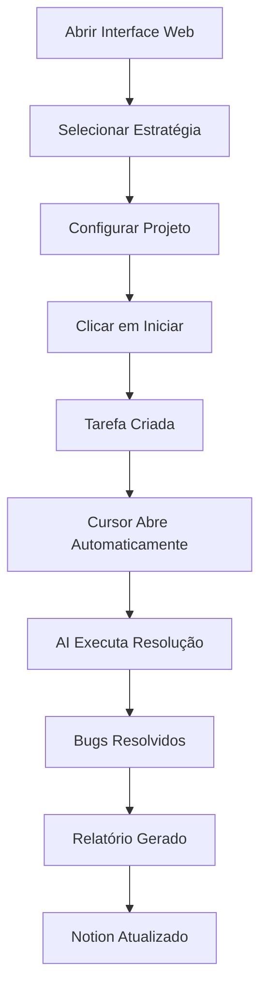

# 🚀 Quick Start - Interface Web do Bridge

## ⚡ Início Rápido (3 passos)

### 1️⃣ Instale as Dependências (se ainda não fez)
```bash
npm install
```

### 2️⃣ Inicie o Servidor
```bash
npm start
```

Você verá algo assim:
```
======================================================================
🚀 Bug Resolver API está rodando!
======================================================================

📡 URLs disponíveis:

   Local:    http://localhost:3001/api/bug-resolver
   Rede:     http://192.168.1.100:3001/api/bug-resolver

📌 Use o endereço de REDE para acessar de outros computadores
======================================================================
```

### 3️⃣ Acesse a Interface Web
Abra seu navegador em: **`http://localhost:3001`**

🎉 **Pronto! A interface estará rodando!**

---

## 🎯 Primeiro Uso

### Configuração Inicial

1. **Abra a interface** em `http://localhost:3001`

2. **Selecione uma estratégia** (recomendamos começar com "Bugs Não Iniciados" 🚀)

3. **Preencha os campos:**
   - ✅ **URL do Database do Notion**: Cole a URL do seu database
   - ✅ **Projeto**: Selecione da lista (ex: `syntra`)
   - ⚙️ **Sub-projeto** (opcional): Selecione `back` ou `front` se necessário
   - 💡 **Contexto**: Descreva as tecnologias (ex: "Backend NestJS")
   - 🔧 **Commit automático**: Deixe marcado se quiser commits automáticos

4. **Clique em "Iniciar Resolução Automática"**

5. **Aguarde!** O Cursor será aberto automaticamente e começará a trabalhar!

---

## 📋 Estrutura de Projetos

Para que o sistema funcione, seus projetos devem estar na pasta `projects/`:

```
bridge/
└── projects/
    └── syntra/              # Projeto principal
        ├── syntrafi-back/   # Sub-projeto backend
        └── syntrafi-front/  # Sub-projeto frontend
```

**Como adicionar um projeto:**
```bash
cd projects
git clone https://github.com/user/seu-projeto.git
```

---

## 🎨 Entendendo as Estratégias

| Estratégia | Quando Usar | Busca por |
|------------|-------------|-----------|
| 🚀 **Não Iniciados** | Começar bugs novos | Status = "Não Iniciado" |
| 🔄 **Reprovados** | Corrigir bugs rejeitados | Status = "Reprovado" |
| ⚡ **Em Andamento** | Finalizar bugs iniciados | Status = "Em Andamento" |
| 🔥 **Alta Prioridade** | Emergências | Prioridade = "Crítica" ou "Alta" |
| 📋 **Todos Pendentes** | Limpar backlog | Status ≠ "Concluído" |
| ⚙️ **Personalizado** | Casos específicos | Filtro customizado |

---

## 🧪 Teste Rápido

### Usando a Interface Web:

1. Acesse `http://localhost:3001`
2. Selecione **"Bugs Não Iniciados"**
3. Preencha:
   - Notion Database URL: `https://notion.so/workspace/seu-db`
   - Projeto: `syntra`
   - Sub-projeto: `back`
   - Contexto: `Backend NestJS`
4. Clique em **"Iniciar Resolução Automática"**

### Via API (Postman/cURL):

```bash
curl -X POST http://localhost:3001/api/bug-resolver \
  -H "Content-Type: application/json" \
  -d '{
    "notionDatabaseUrl": "https://notion.so/workspace/seu-db",
    "projectName": "syntra",
    "subProject": "back",
    "strategy": "nao-iniciado",
    "autoCommit": true
  }'
```

---

## 📊 Monitoramento

### Ver Tarefas Recentes
Na interface, role até "📋 Tarefas Recentes" ou acesse:
```
http://localhost:3001/api/tasks
```

### Ver Relatórios Gerados
```
http://localhost:3001/api/results
```

### Ver Projetos Disponíveis
```
http://localhost:3001/api/projects
```

### Ver Estratégias Disponíveis
```
http://localhost:3001/api/strategies
```

---

## 🔍 Verificando o Progresso

### 1. Terminal do Servidor
Acompanhe logs em tempo real no terminal onde rodou `npm start`

### 2. Cursor AI
O Cursor será aberto automaticamente e você verá a execução no chat

### 3. Pasta `results/`
Relatórios completos são salvos aqui:
```
bridge/results/
├── relatorio-nao-iniciados-1234567890.md
├── relatorio-reprovados-1234567891.md
└── relatorio-completo-1234567892.md
```

### 4. Notion
Verifique no Notion que os status dos bugs foram atualizados!

---

## ⚠️ Troubleshooting

### Erro: "Projeto não encontrado"
- ✅ Verifique se o projeto está em `bridge/projects/`
- ✅ Tente atualizar a página da interface

### Erro: "Notion Database não encontrado"
- ✅ Verifique se a URL do Notion está correta
- ✅ Verifique se o MCP do Notion está configurado

### Cursor não abre automaticamente
- ✅ Verifique se o comando `cursor` está no PATH
- ✅ Abra manualmente o arquivo em `tasks/` no Cursor
- ✅ Copie e cole a mensagem exibida no terminal no chat do Cursor

### Interface não carrega
- ✅ Certifique-se que o servidor está rodando (`npm start`)
- ✅ Verifique se a porta 3001 não está em uso
- ✅ Tente acessar `http://localhost:3001` diretamente

---

## 🎯 Fluxo Completo de Uso



---

## 🚀 Próximos Passos

Agora que a interface está funcionando:

1. ✅ Configure seus projetos em `projects/`
2. ✅ Configure o MCP do Notion (se ainda não fez)
3. ✅ Configure o webhook do Notion (opcional)
4. ✅ Teste cada estratégia para entender as diferenças
5. ✅ Ajuste os prompts em `prompt-templates/` se necessário

---

## 📚 Documentação Completa

- 📖 [INTERFACE-WEB.md](./INTERFACE-WEB.md) - Documentação completa da interface
- 📖 [README.md](./README.md) - Documentação geral do Bridge
- 📋 [exemplo-estrategias.json](./exemplo-estrategias.json) - Exemplos de requisições

---

## 💡 Dicas Pro

### Dica 1: Atalho de Teclado
Adicione um bookmark para `http://localhost:3001` no seu navegador!

### Dica 2: Múltiplas Janelas
Abra a interface em uma janela e o Cursor em outra para acompanhar em tempo real.

### Dica 3: Personalize os Prompts
Edite os templates em `prompt-templates/index.js` para adaptar ao seu fluxo de trabalho.

### Dica 4: Auto-Refresh
A lista de tarefas pode ser atualizada clicando no botão "🔄 Atualizar".

---

## 🎉 Tudo Pronto!

Agora você está pronto para usar o Bridge com a interface visual!

**Não precisa mais usar Postman!** 🚀

Qualquer dúvida, consulte a documentação completa em [INTERFACE-WEB.md](./INTERFACE-WEB.md)

